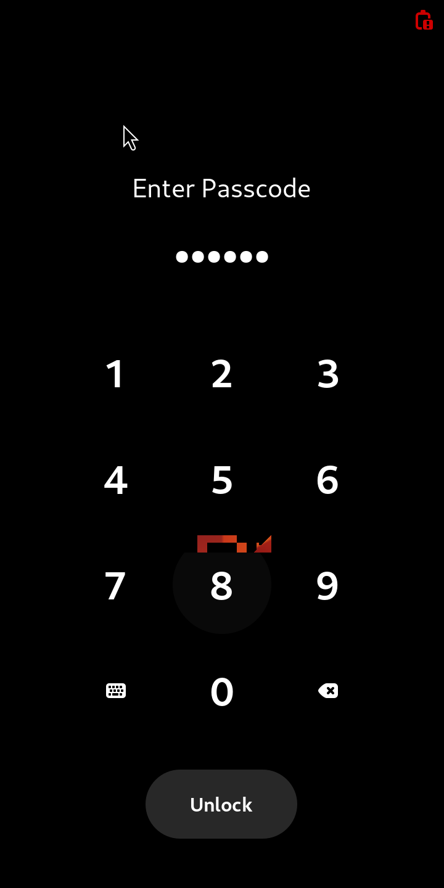
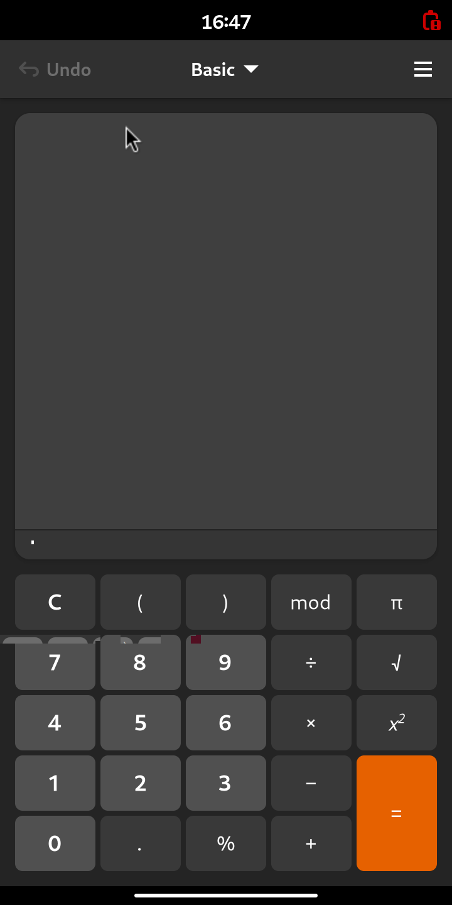
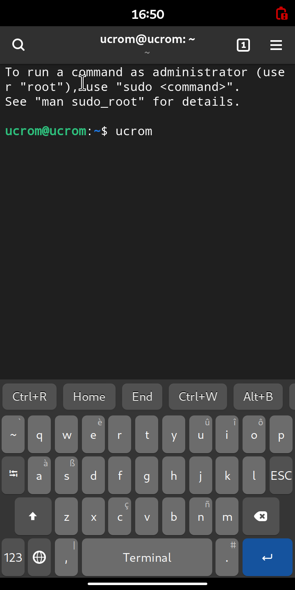
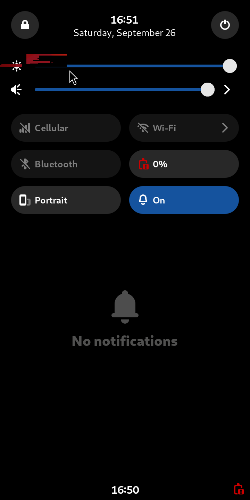
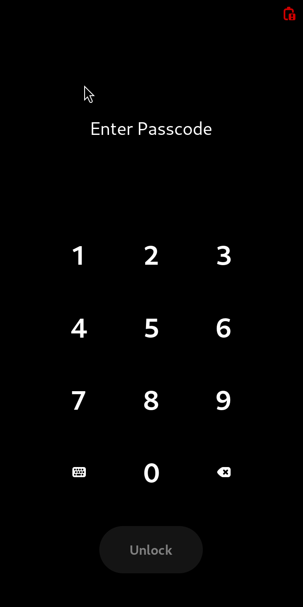
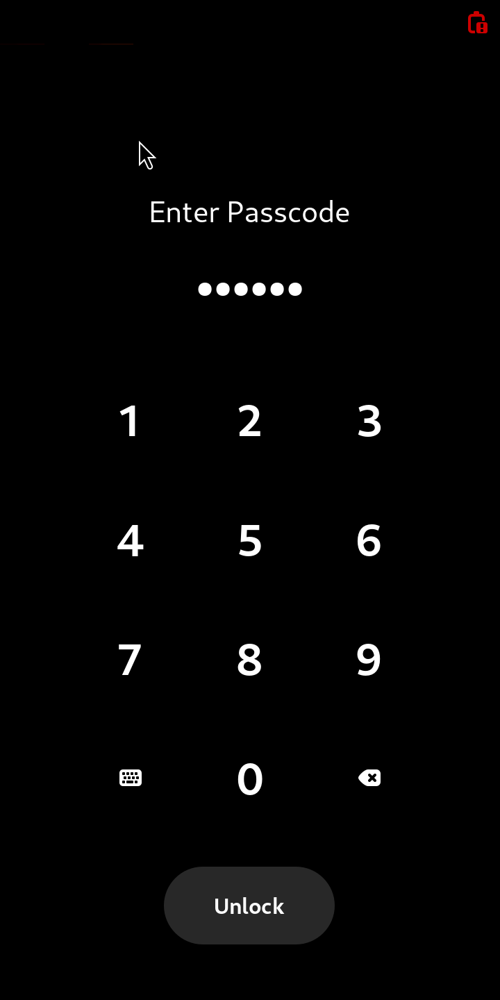

# ucrom test report

Generated 2026-09-26 17:15:39 UTC by `make report` (pytest). Everything below was produced by the automated suite in `tests/` against the images built from this repository.

**79 passed, 27 failed, 1 skipped** out of 107 tests.

## 1. The built OS image

| Result | Test | Time |
|---|---|---|
| PASS | The OS identifies itself as ucrom | 0.0 s |
| PASS | Phone shell, apps and services are installed | 0.4 s |
| PASS | Phone shell, apps and services are installed | 0.4 s |
| PASS | Phone shell, apps and services are installed | 0.4 s |
| PASS | Phone shell, apps and services are installed | 0.4 s |
| PASS | Phone shell, apps and services are installed | 0.4 s |
| PASS | Phone shell, apps and services are installed | 0.4 s |
| PASS | Phone shell, apps and services are installed | 0.4 s |
| PASS | Phone shell, apps and services are installed | 0.4 s |
| PASS | Phone shell, apps and services are installed | 0.4 s |
| PASS | Phone shell, apps and services are installed | 0.4 s |
| PASS | Phone shell, apps and services are installed | 0.4 s |
| PASS | Phone shell, apps and services are installed | 0.4 s |
| PASS | Phone shell, apps and services are installed | 0.4 s |
| PASS | Phone shell, apps and services are installed | 0.4 s |
| PASS | Phone shell, apps and services are installed | 0.4 s |
| PASS | Phone shell, apps and services are installed | 0.4 s |
| PASS | Phone shell, apps and services are installed | 0.4 s |
| PASS | Node.js 22 is present for Claude Code / Codex | 0.2 s |
| PASS | Touch-only udev rule is installed and valid | 0.1 s |
| PASS | USB/Bluetooth keyboard & mouse drivers can never load | 0.0 s |
| PASS | BlueZ cannot pair keyboards or mice | 0.0 s |
| PASS | No login consoles, SysRq off, no SSH server, root locked | 0.4 s |
| PASS | The on-screen keyboard is on by default | 0.0 s |
| PASS | App Hub, Hardware Check and the hardware helpers are installed | 0.0 s |
| PASS | NetworkManager manages every network device (USB Ethernet, USB tethering too) | 0.0 s |

### The OS identifies itself as ucrom

- NAME="ucrom" | VERSION="0.1 (touch)" | ID=ucrom | ID_LIKE="ubuntu debian" | PRETTY_NAME="ucrom 0.1" | VERSION_ID="0.1" | VERSION_CODENAME=noble | UBUNTU_CODENAME=noble | HOME_URL="https://github.com/srimi1/ucrom" | SUPPORT_URL="https://github.com/srimi1/ucrom/issues" | LOGO=phone

### Node.js 22 is present for Claude Code / Codex

- node v22.23.3

### Touch-only udev rule is installed and valid

- udevadm verify: rc=0 1 udev rules files have been checked.
  Success: 1
  Fail:    0

## 2. Boot on the emulated phone

| Result | Test | Time |
|---|---|---|
| PASS | Boots to the Phosh touch shell | 87.5 s |
| PASS | The running system is ucrom on an arm64 kernel | 0.6 s |
| PASS | No system service failed | 0.6 s |
| PASS | The phone user's session runs Phosh (not root) | 1.1 s |

### Boots to the Phosh touch shell

- guest agent answered after 76 s (arm64 under TCG emulation, no KVM)


### The running system is ucrom on an arm64 kernel

- ucrom 0.1 | aarch64 | ucrom

### No system service failed

- failed units: none

### The phone user's session runs Phosh (not root)

- phosh runs as: ucrom

## 3. Touch-only enforcement (keyboards and mice blocked)

| Result | Test | Time |
|---|---|---|
| PASS | Keyboard and mouse are inhibited in the kernel; touchscreen is live | 1.6 s |
| PASS | libinput (what the shell uses) only sees the touchscreen and the power button | 1.1 s |
| FAIL | Typing on the keyboard delivers zero events and changes nothing on screen | 68.3 s |
| PASS | Moving and clicking the mouse delivers zero events | 27.8 s |
| PASS | Plugging in a USB keyboard and mouse: no driver ever binds | 15.8 s |
| PASS | No SysRq, no text consoles, no SSH | 3.8 s |
| PASS | Touches on the screen do reach the system | 21.6 s |

### Keyboard and mouse are inhibited in the kernel; touchscreen is live

- gpio-keys: allowed
- QEMU Virtio MultiTouch: allowed
- QEMU Virtio Keyboard: BLOCKED
- QEMU Virtio Mouse: BLOCKED

### libinput (what the shell uses) only sees the touchscreen and the power button

- libinput devices: QEMU Virtio MultiTouch, gpio-keys

### Typing on the keyboard delivers zero events and changes nothing on screen

- events that reached the keyboard device node: 0
- screen change below status bar: (156, 560, 564, 1335)

```
yboard
        ui.wake(phone)   # compare the lit lock screen, not a blanked panel
        while int(phone.sh("date +%S").out.strip() or 0) > 15:
            time.sleep(2)
        _read_events(phone, "Keyboard", 20)
        time.sleep(1)
        before = evidence.screenshot(phone, "before-typing")
        phone.type_on_hardware_keyboard("hello ucrom\n")
        phone.type_on_hardware_keyboard("rm -rf /\n")
        time.sleep(8)
        after = evidence.screenshot(phone, "after-typing")
        phone.wait_until("test -f /tmp/ucrom-evcount-Keyboard", timeout=60, interval=1)
        n = phone.sh("cat /tmp/ucrom-evcount-Keyboard").out.strip()
        evidence.note(f"events that reached the keyboard device node: {n}")
        assert n == "0"
        from PIL import Image, ImageChops
        a, b = Image.open(before).convert("RGB"), Image.open(after).convert("RGB")
        # ignore the status bar (clock may tick)
        box = (0, 40, a.width, a.height)
        d = ImageChops.difference(a, b).convert("L")
        # the (unused) pointer sprite rests at its start position and is drawn
        # as a separate cursor plane that screendumps show intermittently; blank
        # its spot. A pointer that moved would show up anywhere else.
        d.paste(0, CURSOR_HOME)
        diff = d.crop(box).getbbox()
        evidence.note(f"screen change below status bar: {diff}")
>       assert diff is None
E       assert (156, 560, 564, 1335) is None

tests/test_20_touch_only.py:107: AssertionError
```

 

### Moving and clicking the mouse delivers zero events

- events that reached the mouse device node: 0

### Plugging in a USB keyboard and mouse: no driver ever binds

- USB devices (product|bound driver): QEMU USB Keyboard|; QEMU USB Mouse|; xHCI Host Controller|hub; xHCI Host Controller|hub
- new input devices: none
- explicit 'modprobe usbhid' -> rc=1 modprobe: ERROR: ../libkmod/libkmod-module.c:1084 command_do() Error running install command '/bin/false' for module usbhid: retcode 1
modprobe: ERROR: could not insert 'usbhid': Invalid argument

### No SysRq, no text consoles, no SSH

- getty processes: none

### Touches on the screen do reach the system

- touch events delivered for one tap: 2

## 4. Using the phone by touch only

| Result | Test | Time |
|---|---|---|
| PASS | Swipe up, tap the PIN on the pad, phone unlocks | 53.1 s |
| FAIL | Open Calculator from the app grid and compute 7 × 6 by tapping | 239.5 s |
| PASS | Type text using only on-screen keyboard taps | 87.1 s |
| PASS | Swipe down from the top opens quick settings | 11.3 s |
| PASS | The phone's power button blanks and locks the screen (never shuts down) | 58.1 s |

### Swipe up, tap the PIN on the pad, phone unlocks

- PIN pad keys located and read back by OCR: 1->'1', 2->'2', 4->'4', 5->'5', 7->'7', 8->'8'
- unlocked by touch in 29 s

   

### Open Calculator from the app grid and compute 7 × 6 by tapping

- calculator keys located from the 'mod' button, read back by OCR: C->'C', 7->'7', x->'x', 6->'6', =->'a'
- no result yet, tapping '=' again (attempt 2)
- no result yet, tapping '=' again (attempt 3)
- no result yet, tapping '=' again (attempt 4)

```
          break
            if covered and i in (5, 10):
                # nudge: tapping the entry makes the app re-fit above the keyboard
                phone.tap(phone.w / 2, pos[1] - 150 * k, hold=0.1)
            last = pos
            time.sleep(3)
        assert mod, f"calculator keypad not visible (last 'mod' at {last})"
        evidence.rec["shots"].append({"file": str(shot.relative_to(shot.parent.parent)), "label": "calculator"})
        read = []
        for key in ("C", "7", "x", "6", "="):
            dx, dy = ui.CALC_KEYS[key]
            x, y = mod[0] + dx * k, mod[1] + dy * k
            read.append(f"{key}->{phone.read_char(shot, x, y)!r}")
            phone.tap(x, y, hold=0.12)
            time.sleep(1.2)
        evidence.note("calculator keys located from the 'mod' button, read back by OCR: " + ", ".join(read))
        res = None
        for attempt in range(3):
            try:
                res = ui.wait_for_text(phone, evidence, r"42", timeout=30, label="result")
                break
            except VMError:
                # under emulation a tap can be dropped while the app is busy
                dx, dy = ui.CALC_KEYS["="]
                evidence.note(f"no result yet, tapping '=' again (attempt {attempt + 2})")
                phone.tap(mod[0] + dx * k, mod[1] + dy * k, hold=0.12)
>       assert res, "calculator never showed 42"
E       AssertionError: calculator never showed 42
E       assert None

tests/test_30_touch_ux.py:83: AssertionError
```

 

### Type text using only on-screen keyboard taps

- on-screen keyboard layout: Terminal
- keys read back by OCR: u->'u', c->'c.', r->'r', o->'_', m->'m'
- terminal text: 16:50 ucrom@ucrom: ~ = q ~ ea) —— — to run a command as administrator (use r "root"), use "sudo <command>". see "man sudo_root" for details. ucrom@ucrom: $ ucrom

 

### Swipe down from the top opens quick settings

- quick settings text: 16:51 a (0) Saturday, September 26 N € —_—_—_—_—_=@> Nl Cellular Wi-Fi > XX Bluetooth 0% D) Portrait Ga» a wv No notifications 16:50 (a
- quick-setting tiles seen: ['Wi-Fi', 'Bluetooth', 'Portrait']



### The phone's power button blanks and locks the screen (never shuts down)

- locked; the system kept running (logind ignores the power key)
- PIN pad keys located and read back by OCR: 1->'1', 2->'2', 4->'4', 5->'5', 7->'7', 8->'8'

   

## 5. AI agents and developer apps

| Result | Test | Time |
|---|---|---|
| FAIL | App Hub opens from the app grid by touch | 140.8 s |
| FAIL | AI coding agent installs from its official source and starts in the touch terminal | 129.3 s |
| FAIL | AI coding agent installs from its official source and starts in the touch terminal | 126.9 s |
| FAIL | VS Code (same Electron/VS Code base as Antigravity) installs and runs, scaled to the phone | 127.8 s |
| PASS | A Python AI tool (llm) installs with pipx | 659.5 s |

### App Hub opens from the app grid by touch


```
 _ _ _ _ _ _ _ _ _ _ _ _ _ _ _ _ _ _ 
tests/test_40_apps.py:43: in open_hub
    ui.open_favorite(phone, evidence, "io.ucrom.AppHub.desktop", "apphub.py", r"App Hub|Install|Claude")
_ _ _ _ _ _ _ _ _ _ _ _ _ _ _ _ _ _ _ _ _ _ _ _ _ _ _ _ _ _ _ _ _ _ _ _ _ _ _ _ 

phone = <vm.PhoneVM object at 0x7f1d38511c90>
evidence = <conftest.Evidence object at 0x7f1d37b27050>
desktop_id = 'io.ucrom.AppHub.desktop', process = 'apphub.py'
ready_text = 'App Hub|Install|Claude', timeout = 300

        shot = Path(tempfile.mkdtemp()) / "overview.png"
        for _ in range(tries):
            phone.swipe(phone.w / 2, phone.h - 3, phone.w / 2, phone.h * 0.55, duration=0.6, steps=15)
            time.sleep(4)
            phone.screenshot(shot)
            # the field's grey placeholder text OCRs with low confidence
            pos = phone.find_text(shot, r"Search( apps\.*)?", min_conf=15)
            if pos:
                return pos
        return None
    
    
    def _k(phone):
        return phone.h / 1440
    
    
    def open_favorite(phone, evidence, desktop_id, process, ready_text, timeout=300):
        """Tap an app in the favourites rows of the app grid. Favourites are a
        4-column grid right under the "Search apps" field; their order is the
        configured favourites list (read from gsettings, state only)."""
>       favs = phone.sh("gsettings get sm.puri.phosh favorites", user=True).out
E       vm.VMError: app grid not found (search field at None)

tests/ui.py:167: VMError
```

### AI coding agent installs from its official source and starts in the touch terminal


```
 _ _ _ _ _ _ _ _ _ _ _ _ _ _ _ _ _ _ 
tests/test_40_apps.py:43: in open_hub
    ui.open_favorite(phone, evidence, "io.ucrom.AppHub.desktop", "apphub.py", r"App Hub|Install|Claude")
_ _ _ _ _ _ _ _ _ _ _ _ _ _ _ _ _ _ _ _ _ _ _ _ _ _ _ _ _ _ _ _ _ _ _ _ _ _ _ _ 

phone = <vm.PhoneVM object at 0x7f1d38511c90>
evidence = <conftest.Evidence object at 0x7f1d38448ed0>
desktop_id = 'io.ucrom.AppHub.desktop', process = 'apphub.py'
ready_text = 'App Hub|Install|Claude', timeout = 300

        shot = Path(tempfile.mkdtemp()) / "overview.png"
        for _ in range(tries):
            phone.swipe(phone.w / 2, phone.h - 3, phone.w / 2, phone.h * 0.55, duration=0.6, steps=15)
            time.sleep(4)
            phone.screenshot(shot)
            # the field's grey placeholder text OCRs with low confidence
            pos = phone.find_text(shot, r"Search( apps\.*)?", min_conf=15)
            if pos:
                return pos
        return None
    
    
    def _k(phone):
        return phone.h / 1440
    
    
    def open_favorite(phone, evidence, desktop_id, process, ready_text, timeout=300):
        """Tap an app in the favourites rows of the app grid. Favourites are a
        4-column grid right under the "Search apps" field; their order is the
        configured favourites list (read from gsettings, state only)."""
>       favs = phone.sh("gsettings get sm.puri.phosh favorites", user=True).out
E       vm.VMError: app grid not found (search field at None)

tests/ui.py:167: VMError
```

### AI coding agent installs from its official source and starts in the touch terminal


```
 _ _ _ _ _ _ _ _ _ _ _ _ _ _ _ _ _ _ 
tests/test_40_apps.py:43: in open_hub
    ui.open_favorite(phone, evidence, "io.ucrom.AppHub.desktop", "apphub.py", r"App Hub|Install|Claude")
_ _ _ _ _ _ _ _ _ _ _ _ _ _ _ _ _ _ _ _ _ _ _ _ _ _ _ _ _ _ _ _ _ _ _ _ _ _ _ _ 

phone = <vm.PhoneVM object at 0x7f1d38511c90>
evidence = <conftest.Evidence object at 0x7f1d37b08550>
desktop_id = 'io.ucrom.AppHub.desktop', process = 'apphub.py'
ready_text = 'App Hub|Install|Claude', timeout = 300

        shot = Path(tempfile.mkdtemp()) / "overview.png"
        for _ in range(tries):
            phone.swipe(phone.w / 2, phone.h - 3, phone.w / 2, phone.h * 0.55, duration=0.6, steps=15)
            time.sleep(4)
            phone.screenshot(shot)
            # the field's grey placeholder text OCRs with low confidence
            pos = phone.find_text(shot, r"Search( apps\.*)?", min_conf=15)
            if pos:
                return pos
        return None
    
    
    def _k(phone):
        return phone.h / 1440
    
    
    def open_favorite(phone, evidence, desktop_id, process, ready_text, timeout=300):
        """Tap an app in the favourites rows of the app grid. Favourites are a
        4-column grid right under the "Search apps" field; their order is the
        configured favourites list (read from gsettings, state only)."""
>       favs = phone.sh("gsettings get sm.puri.phosh favorites", user=True).out
E       vm.VMError: app grid not found (search field at None)

tests/ui.py:167: VMError
```

### VS Code (same Electron/VS Code base as Antigravity) installs and runs, scaled to the phone


```
 _ _ _ _ _ _ _ _ _ _ _ _ _ _ _ _ _ _ 
tests/test_40_apps.py:43: in open_hub
    ui.open_favorite(phone, evidence, "io.ucrom.AppHub.desktop", "apphub.py", r"App Hub|Install|Claude")
_ _ _ _ _ _ _ _ _ _ _ _ _ _ _ _ _ _ _ _ _ _ _ _ _ _ _ _ _ _ _ _ _ _ _ _ _ _ _ _ 

phone = <vm.PhoneVM object at 0x7f1d38511c90>
evidence = <conftest.Evidence object at 0x7f1d37b02890>
desktop_id = 'io.ucrom.AppHub.desktop', process = 'apphub.py'
ready_text = 'App Hub|Install|Claude', timeout = 300

        shot = Path(tempfile.mkdtemp()) / "overview.png"
        for _ in range(tries):
            phone.swipe(phone.w / 2, phone.h - 3, phone.w / 2, phone.h * 0.55, duration=0.6, steps=15)
            time.sleep(4)
            phone.screenshot(shot)
            # the field's grey placeholder text OCRs with low confidence
            pos = phone.find_text(shot, r"Search( apps\.*)?", min_conf=15)
            if pos:
                return pos
        return None
    
    
    def _k(phone):
        return phone.h / 1440
    
    
    def open_favorite(phone, evidence, desktop_id, process, ready_text, timeout=300):
        """Tap an app in the favourites rows of the app grid. Favourites are a
        4-column grid right under the "Search apps" field; their order is the
        configured favourites list (read from gsettings, state only)."""
>       favs = phone.sh("gsettings get sm.puri.phosh favorites", user=True).out
E       vm.VMError: app grid not found (search field at None)

tests/ui.py:167: VMError
```

### A Python AI tool (llm) installs with pipx

- - llm
llm, version 0.36
==> launcher added: LLM

## 6. ucrom hardware helpers (simulated hardware)

| Result | Test | Time |
|---|---|---|
| PASS | Alert slider: up/middle/down switch silent / vibrate / ring | 46.5 s |
| PASS | Pop-up camera rises with the front camera and drops on a fall | 17.6 s |
| PASS | Front-camera detection from Android's camera service output | 0.0 s |
| PASS | In-display fingerprint: locking starts a scan, the sensor lights up, a match unlocks | 25.1 s |
| PASS | Refresh-rate helper finds the panel and applies a mode | 5.8 s |
| PASS | Hardware Check runs and tells the truth about the emulator | 30.0 s |
| PASS | Refresh-rate choice keeps the panel's resolution (7T Pro: 1440x3120 at 60/90 Hz) | 0.0 s |

### Alert slider: up/middle/down switch silent / vibrate / ring

- virtual slider is ID_INPUT_KEY=1, not a keyboard, not blocked: True
- slider position 1 -> 'up silent', feedbackd profile 'silent'
- slider position 2 -> 'middle quiet', feedbackd profile 'quiet'
- slider position 3 -> 'down full', feedbackd profile 'full'

### Pop-up camera rises with the front camera and drops on a fall

- front camera opened -> motor up
- front camera closed -> motor down
- free fall at 1790442869.239485088; helper log:
ucrom-popup-camera: camera up (front camera opened)
ucrom-popup-camera: camera down (front camera closed)
ucrom-popup-camera: camera up (front camera opened)
ucrom-popup-camera: camera down (free fall)
ucrom-popup-camera: camera down (free fall)
ucrom-popup-camera: camera down (free fall)
ucrom-popup-camera: camera down (free fall)
ucrom-popup-camera: camera down (free fall)
ucrom-popup-camera: camera down (free fall)
1790442867.859815168 dir=1
1790442871.001776976 dir=0
1790442871.720539824 dir=0

### In-display fingerprint: locking starts a scan, the sensor lights up, a match unlocks

- while scanning: dimlayer_bl_en/light = 1on 
- ucrom-fod: this device has no in-display fingerprint sensor
ucrom-fod: identify requested (reply 0)
ucrom-fod: sensor light on
ucrom-fod: finger right-thumb identified; unlocking
ucrom-fod: sensor light off
right-thumb
0

 

### Refresh-rate helper finds the panel and applies a mode

- ucrom-refresh-rate: Virtual-1 -> 720x1440@59.876Hz | current mode before ['720x1440 px'], after ['720x1440 px']

### Hardware Check runs and tells the truth about the emulator

- ucrom system: PASS - ucrom 0.1 | device emulator/generic | flavor mainline | kernel 6.8.0-142-generic
- Touchscreen: PASS - QEMU Virtio MultiTouch
- Keyboard/mouse blocked: PASS - 2 keyboard/mouse device(s) present and inhibited
- Power/volume buttons: PASS - gpio-keys
- Display: PASS - 5120x2160, refresh rates: 50, 60, 75 Hz
- GPU acceleration: ABSENT - render node driver(s): virtio-pci (no hardware 3D)
- Wi-Fi: ABSENT - no Wi-Fi adapter
- Bluetooth: ABSENT - no Bluetooth adapter (BlueZ)
- Mobile network (calls/SMS/data): ABSENT - no modem found
- Speaker and microphone: ASK - 37 output(s)
- Cameras: ABSENT - no camera
- Pop-up camera: ABSENT - no camera motor
- Fingerprint: ABSENT - no fingerprint service/device
- Sensors: ABSENT - no rotation/light/proximity sensors
- Vibration: ABSENT - no vibration motor
- Flashlight: ABSENT - no flash LED
- NFC: ABSENT - no NFC adapter
- GPS: ABSENT - geoclue present, no GNSS source
- Battery and charging: ABSENT - no battery (mains/emulator)
- Alert slider: ABSENT - no alert slider

## 7. OnePlus 7T Pro McLaren (hotdog) build

| Result | Test | Time |
|---|---|---|
| PASS | Kernel: LineageOS 20 kernel for OnePlus sm8150 (7T Pro) | 0.0 s |
| PASS | 7T Pro hardware drivers are built into the kernel | 0.0 s |
| PASS | 7T Pro hardware drivers are built into the kernel | 0.0 s |
| PASS | 7T Pro hardware drivers are built into the kernel | 0.0 s |
| PASS | 7T Pro hardware drivers are built into the kernel | 0.0 s |
| PASS | 7T Pro hardware drivers are built into the kernel | 0.0 s |
| PASS | 7T Pro hardware drivers are built into the kernel | 0.0 s |
| PASS | 7T Pro hardware drivers are built into the kernel | 0.0 s |
| PASS | 7T Pro hardware drivers are built into the kernel | 0.0 s |
| PASS | 7T Pro hardware drivers are built into the kernel | 0.0 s |
| PASS | 7T Pro hardware drivers are built into the kernel | 0.0 s |
| PASS | 7T Pro hardware drivers are built into the kernel | 0.0 s |
| PASS | 7T Pro hardware drivers are built into the kernel | 0.0 s |
| PASS | 7T Pro hardware drivers are built into the kernel | 0.0 s |
| PASS | 7T Pro hardware drivers are built into the kernel | 0.0 s |
| PASS | 7T Pro hardware drivers are built into the kernel | 0.0 s |
| PASS | Every option ucrom needs for systemd + Halium is set | 0.0 s |
| PASS | HID keyboard/mouse drivers, SysRq and VT are compiled out | 0.0 s |
| PASS | Halium's own check-kernel-config: only deliberate differences remain | 1.8 s |
| PASS | boot.img: header v2, kernel + ucrom initramfs + sm8150 DTBs + right cmdline | 1.2 s |
| PASS | Initramfs: Halium boot logic + ucrom touch-only rules from the first second | 1.3 s |
| PASS | dtbo.img: valid Android DT table with the 7T Pro (19801) overlays | 0.0 s |
| PASS | Mainline fallback: ucrom's own 7T Pro device tree compiles and is correct | 0.0 s |

### Kernel: LineageOS 20 kernel for OnePlus sm8150 (7T Pro)

- repo: https://github.com/LineageOS/android_kernel_oneplus_sm8150
- ref: lineage-20
- commit: 2947e6b4dc5f778307b138cd382db103419c4bcb
- release: 4.14.180-perf+
- compiler: Ubuntu clang version 18.1.3 (1ubuntu1)
- fragment_mismatches: 0

### Every option ucrom needs for systemd + Halium is set

- 37 required options checked, missing: none; must-be-off but on: none

### HID keyboard/mouse drivers, SysRq and VT are compiled out

- checked off: CONFIG_USB_HID, CONFIG_USB_HIDDEV, CONFIG_USB_KBD, CONFIG_USB_MOUSE, CONFIG_BT_HIDP, CONFIG_UHID, CONFIG_USB_CONFIGFS_F_HID, CONFIG_INPUT_MOUSEDEV, CONFIG_INPUT_KEYBOARD_USB, CONFIG_MAGIC_SYSRQ

### Halium's own check-kernel-config: only deliberate differences remain

- Halium checker items not met: 83; deliberate: ['CONFIG_BT_HIDP']; other: ['CONFIG_ANDROID_PARANOID_NETWORK', 'CONFIG_ARM_UNWIND', 'CONFIG_AUDITSYSCALL', 'CONFIG_AUDIT_TREE', 'CONFIG_AUDIT_WATCH', 'CONFIG_BT_BNEP_MC_FILTER', 'CONFIG_BT_BNEP_PROTO_FILTER', 'CONFIG_BT_HCIBPA10X', 'CONFIG_BT_RFCOMM_TTY', 'CONFIG_CGROUP_MEM_RES_CTLR', 'CONFIG_CGROUP_MEM_RES_CTLR_KMEM', 'CONFIG_CGROUP_MEM_RES_CTLR_SWAP', 'CONFIG_CGROUP_PERF', 'CONFIG_CIFS_DFS_UPCALL', 'CONFIG_CIFS_UPCALL', 'CONFIG_CORE_DUMP_DEFAULT_ELF_HEADERS', 'CONFIG_DEBUG_RODATA', 'CONFIG_DEFAULT_SECURITY_APPARMOR', 'CONFIG_DEFAULT_SECURITY_TOMOYO', 'CONFIG_DEFAULT_SECURITY_YAMA', 'CONFIG_DEVKMEM', 'CONFIG_DEVPTS_MULTIPLE_INSTANCES', 'CONFIG_DEVTMPFS_MOUNT', 'CONFIG_DNS_RESOLVER', 'CONFIG_ENCRYPTED_KEYS']

### boot.img: header v2, kernel + ucrom initramfs + sm8150 DTBs + right cmdline

- mkbootimg args: --header_version 2 --os_version 13.0.0 --os_patch_level 2023-12 --kernel /tmp/pytest-of-root/pytest-2/test_boot_image0/kernel --ramdisk /tmp/pytest-of-root/pytest-2/test_boot_image0/ramdisk --dtb /tmp/pytest-of-root/pytest-2/test_boot_image0/dtb --pagesize 0x00001000 --base 0x00000000 --kernel_offset 0x00008000 --ramdisk_offset 0x01000000 --second_offset 0x00000000 --tags_offset 0x00000100 --dtb_offset 0x0000000001f00000 --board '' --cmdline 'androidboot.hardware=qcom androidboot.memcg=1 androidboot.usbcontroller=a600000.dwc3 androidboot.vbmeta.avb_version=1.0 loop.max_part=7 lpm_levels.sleep_
- DTBs in boot image: 20
- boot.img size 69619712 bytes (partition 100663296)

### Initramfs: Halium boot logic + ucrom touch-only rules from the first second

- initramfs files: 646; halium script + ucrom touch-only rule present

### dtbo.img: valid Android DT table with the 7T Pro (19801) overlays

- 10 overlays, 3216221 bytes, size_ok=True

### Mainline fallback: ucrom's own 7T Pro device tree compiles and is correct

- model OnePlus 7T Pro, touch samsung,s6sy761 @0x48 on i2c17, 1440x3120 framebuffer @0x9c000000

## 8. Flashable images

| Result | Test | Time |
|---|---|---|
| SKIP | Boot image structure, checksums and userdata filesystem | 0.0 s |

### Boot image structure, checksums and userdata filesystem


```
Skipped: no device images built
```

## 9. Hardware bridge packages (Halium)

| Result | Test | Time |
|---|---|---|
| PASS | Bridge package builds for Ubuntu noble arm64 | 0.0 s |
| PASS | Bridge package builds for Ubuntu noble arm64 | 0.0 s |
| PASS | Bridge package builds for Ubuntu noble arm64 | 0.0 s |
| PASS | Bridge package builds for Ubuntu noble arm64 | 0.0 s |
| FAIL | Bridge package builds for Ubuntu noble arm64 | 0.0 s |
| PASS | Bridge package builds for Ubuntu noble arm64 | 0.0 s |
| FAIL | Bridge package builds for Ubuntu noble arm64 | 0.0 s |
| FAIL | Bridge package builds for Ubuntu noble arm64 | 0.0 s |
| FAIL | Bridge package builds for Ubuntu noble arm64 | 0.0 s |
| FAIL | Bridge package builds for Ubuntu noble arm64 | 0.0 s |
| FAIL | Bridge package builds for Ubuntu noble arm64 | 0.0 s |
| FAIL | Bridge package builds for Ubuntu noble arm64 | 0.0 s |
| FAIL | Bridge package builds for Ubuntu noble arm64 | 0.0 s |
| FAIL | Bridge package builds for Ubuntu noble arm64 | 0.0 s |
| FAIL | Bridge package builds for Ubuntu noble arm64 | 0.0 s |
| FAIL | Bridge package builds for Ubuntu noble arm64 | 0.0 s |
| FAIL | Bridge package builds for Ubuntu noble arm64 | 0.0 s |
| FAIL | Bridge package builds for Ubuntu noble arm64 | 0.0 s |
| FAIL | Bridge package builds for Ubuntu noble arm64 | 0.0 s |
| FAIL | Bridge package builds for Ubuntu noble arm64 | 0.0 s |
| FAIL | Bridge package builds for Ubuntu noble arm64 | 0.0 s |
| FAIL | Bridge package builds for Ubuntu noble arm64 | 0.0 s |
| FAIL | Bridge package builds for Ubuntu noble arm64 | 0.0 s |
| FAIL | Bridge package builds for Ubuntu noble arm64 | 0.0 s |
| FAIL | Bridge package builds for Ubuntu noble arm64 | 0.0 s |
| FAIL | Bridge package builds for Ubuntu noble arm64 | 0.0 s |
| PASS | Bridge binaries are installed in the halium image and all their libraries resolve | 0.4 s |

### Bridge package builds for Ubuntu noble arm64

- libglibutil: OK 1.0.55 f04a3b7 

### Bridge package builds for Ubuntu noble arm64

- libgbinder: OK 1.1.26 b76f9e4 

### Bridge package builds for Ubuntu noble arm64

- android-headers-30: OK 1:9.0~1 a72e00c 

### Bridge package builds for Ubuntu noble arm64

- libhybris: OK 0.1.0+git20200424-5 fca30e7 - runs Android GPU/HAL libraries under Linux

### Bridge package builds for Ubuntu noble arm64

- halium-wrappers: FAIL 1f43bf2 build: dpkg-buildpackage: error: cannot open file debian/changelog: No such file or directory dpkg-buildpackage: error: cannot open file debian/changelog: No such file or directory  

```
name = 'halium-wrappers'
evidence = <conftest.Evidence object at 0x7f1d37b3c7d0>

    @pytest.mark.skipif(not STATUS.exists(), reason="bridges not built (make bridges)")
    @pytest.mark.parametrize("name", LIST)
    def test_bridge_builds(name, evidence):
        """Bridge package builds for Ubuntu noble arm64"""
        st = status().get(name)
        assert st, f"{name} was not attempted"
        result, version, note = (st + ["", "", ""])[:3]
        evidence.note(f"{name}: {result} {version} {note} {('- ' + WHAT[name]) if name in WHAT else ''}")
>       assert result == "OK", note
E       AssertionError: build: dpkg-buildpackage: error: cannot open file debian/changelog: No such file or directory dpkg-buildpackage: error: cannot open file debian/changelog: No such file or directory 
E       assert 'FAIL' == 'OK'
E         - OK
E         + FAIL

tests/test_62_bridges.py:47: AssertionError
```

### Bridge package builds for Ubuntu noble arm64

- parse-android-dynparts: OK 1.0.0+ubports1 7568bbf 

### Bridge package builds for Ubuntu noble arm64


```
name = 'initramfs-tools-halium'
evidence = <conftest.Evidence object at 0x7f1d3840acd0>

    @pytest.mark.skipif(not STATUS.exists(), reason="bridges not built (make bridges)")
    @pytest.mark.parametrize("name", LIST)
    def test_bridge_builds(name, evidence):
        """Bridge package builds for Ubuntu noble arm64"""
        st = status().get(name)
>       assert st, f"{name} was not attempted"
E       AssertionError: initramfs-tools-halium was not attempted
E       assert None

tests/test_62_bridges.py:44: AssertionError
```

### Bridge package builds for Ubuntu noble arm64


```
name = 'wlroots', evidence = <conftest.Evidence object at 0x7f1d3842e110>

    @pytest.mark.skipif(not STATUS.exists(), reason="bridges not built (make bridges)")
    @pytest.mark.parametrize("name", LIST)
    def test_bridge_builds(name, evidence):
        """Bridge package builds for Ubuntu noble arm64"""
        st = status().get(name)
>       assert st, f"{name} was not attempted"
E       AssertionError: wlroots was not attempted
E       assert None

tests/test_62_bridges.py:44: AssertionError
```

### Bridge package builds for Ubuntu noble arm64


```
name = 'phoc', evidence = <conftest.Evidence object at 0x7f1d37b058d0>

    @pytest.mark.skipif(not STATUS.exists(), reason="bridges not built (make bridges)")
    @pytest.mark.parametrize("name", LIST)
    def test_bridge_builds(name, evidence):
        """Bridge package builds for Ubuntu noble arm64"""
        st = status().get(name)
>       assert st, f"{name} was not attempted"
E       AssertionError: phoc was not attempted
E       assert None

tests/test_62_bridges.py:44: AssertionError
```

### Bridge package builds for Ubuntu noble arm64


```
name = 'bluebinder', evidence = <conftest.Evidence object at 0x7f1d37b0d090>

    @pytest.mark.skipif(not STATUS.exists(), reason="bridges not built (make bridges)")
    @pytest.mark.parametrize("name", LIST)
    def test_bridge_builds(name, evidence):
        """Bridge package builds for Ubuntu noble arm64"""
        st = status().get(name)
>       assert st, f"{name} was not attempted"
E       AssertionError: bluebinder was not attempted
E       assert None

tests/test_62_bridges.py:44: AssertionError
```

### Bridge package builds for Ubuntu noble arm64


```
name = 'ofono', evidence = <conftest.Evidence object at 0x7f1d37b03a50>

    @pytest.mark.skipif(not STATUS.exists(), reason="bridges not built (make bridges)")
    @pytest.mark.parametrize("name", LIST)
    def test_bridge_builds(name, evidence):
        """Bridge package builds for Ubuntu noble arm64"""
        st = status().get(name)
>       assert st, f"{name} was not attempted"
E       AssertionError: ofono was not attempted
E       assert None

tests/test_62_bridges.py:44: AssertionError
```

### Bridge package builds for Ubuntu noble arm64


```
name = 'ofono-binder-plugin'
evidence = <conftest.Evidence object at 0x7f1d37b06590>

    @pytest.mark.skipif(not STATUS.exists(), reason="bridges not built (make bridges)")
    @pytest.mark.parametrize("name", LIST)
    def test_bridge_builds(name, evidence):
        """Bridge package builds for Ubuntu noble arm64"""
        st = status().get(name)
>       assert st, f"{name} was not attempted"
E       AssertionError: ofono-binder-plugin was not attempted
E       assert None

tests/test_62_bridges.py:44: AssertionError
```

### Bridge package builds for Ubuntu noble arm64


```
name = 'ofono2mm', evidence = <conftest.Evidence object at 0x7f1d37b11990>

    @pytest.mark.skipif(not STATUS.exists(), reason="bridges not built (make bridges)")
    @pytest.mark.parametrize("name", LIST)
    def test_bridge_builds(name, evidence):
        """Bridge package builds for Ubuntu noble arm64"""
        st = status().get(name)
>       assert st, f"{name} was not attempted"
E       AssertionError: ofono2mm was not attempted
E       assert None

tests/test_62_bridges.py:44: AssertionError
```

### Bridge package builds for Ubuntu noble arm64


```
name = 'pulseaudio', evidence = <conftest.Evidence object at 0x7f1d37b08490>

    @pytest.mark.skipif(not STATUS.exists(), reason="bridges not built (make bridges)")
    @pytest.mark.parametrize("name", LIST)
    def test_bridge_builds(name, evidence):
        """Bridge package builds for Ubuntu noble arm64"""
        st = status().get(name)
>       assert st, f"{name} was not attempted"
E       AssertionError: pulseaudio was not attempted
E       assert None

tests/test_62_bridges.py:44: AssertionError
```

### Bridge package builds for Ubuntu noble arm64


```
name = 'pulseaudio-modules-droid'
evidence = <conftest.Evidence object at 0x7f1d37b02650>

    @pytest.mark.skipif(not STATUS.exists(), reason="bridges not built (make bridges)")
    @pytest.mark.parametrize("name", LIST)
    def test_bridge_builds(name, evidence):
        """Bridge package builds for Ubuntu noble arm64"""
        st = status().get(name)
>       assert st, f"{name} was not attempted"
E       AssertionError: pulseaudio-modules-droid was not attempted
E       assert None

tests/test_62_bridges.py:44: AssertionError
```

### Bridge package builds for Ubuntu noble arm64


```
name = 'droidmedia', evidence = <conftest.Evidence object at 0x7f1d37b11950>

    @pytest.mark.skipif(not STATUS.exists(), reason="bridges not built (make bridges)")
    @pytest.mark.parametrize("name", LIST)
    def test_bridge_builds(name, evidence):
        """Bridge package builds for Ubuntu noble arm64"""
        st = status().get(name)
>       assert st, f"{name} was not attempted"
E       AssertionError: droidmedia was not attempted
E       assert None

tests/test_62_bridges.py:44: AssertionError
```

### Bridge package builds for Ubuntu noble arm64


```
name = 'gst-droid', evidence = <conftest.Evidence object at 0x7f1d37b64e50>

    @pytest.mark.skipif(not STATUS.exists(), reason="bridges not built (make bridges)")
    @pytest.mark.parametrize("name", LIST)
    def test_bridge_builds(name, evidence):
        """Bridge package builds for Ubuntu noble arm64"""
        st = status().get(name)
>       assert st, f"{name} was not attempted"
E       AssertionError: gst-droid was not attempted
E       assert None

tests/test_62_bridges.py:44: AssertionError
```

### Bridge package builds for Ubuntu noble arm64


```
name = 'droidian-camera'
evidence = <conftest.Evidence object at 0x7f1d384358d0>

    @pytest.mark.skipif(not STATUS.exists(), reason="bridges not built (make bridges)")
    @pytest.mark.parametrize("name", LIST)
    def test_bridge_builds(name, evidence):
        """Bridge package builds for Ubuntu noble arm64"""
        st = status().get(name)
>       assert st, f"{name} was not attempted"
E       AssertionError: droidian-camera was not attempted
E       assert None

tests/test_62_bridges.py:44: AssertionError
```

### Bridge package builds for Ubuntu noble arm64


```
name = 'droidian-fpd', evidence = <conftest.Evidence object at 0x7f1d37bb8c90>

    @pytest.mark.skipif(not STATUS.exists(), reason="bridges not built (make bridges)")
    @pytest.mark.parametrize("name", LIST)
    def test_bridge_builds(name, evidence):
        """Bridge package builds for Ubuntu noble arm64"""
        st = status().get(name)
>       assert st, f"{name} was not attempted"
E       AssertionError: droidian-fpd was not attempted
E       assert None

tests/test_62_bridges.py:44: AssertionError
```

### Bridge package builds for Ubuntu noble arm64


```
name = 'feedbackd', evidence = <conftest.Evidence object at 0x7f1d38436b10>

    @pytest.mark.skipif(not STATUS.exists(), reason="bridges not built (make bridges)")
    @pytest.mark.parametrize("name", LIST)
    def test_bridge_builds(name, evidence):
        """Bridge package builds for Ubuntu noble arm64"""
        st = status().get(name)
>       assert st, f"{name} was not attempted"
E       AssertionError: feedbackd was not attempted
E       assert None

tests/test_62_bridges.py:44: AssertionError
```

### Bridge package builds for Ubuntu noble arm64


```
name = 'flashlightd', evidence = <conftest.Evidence object at 0x7f1d37bb8c50>

    @pytest.mark.skipif(not STATUS.exists(), reason="bridges not built (make bridges)")
    @pytest.mark.parametrize("name", LIST)
    def test_bridge_builds(name, evidence):
        """Bridge package builds for Ubuntu noble arm64"""
        st = status().get(name)
>       assert st, f"{name} was not attempted"
E       AssertionError: flashlightd was not attempted
E       assert None

tests/test_62_bridges.py:44: AssertionError
```

### Bridge package builds for Ubuntu noble arm64


```
name = 'batman', evidence = <conftest.Evidence object at 0x7f1d37b045d0>

    @pytest.mark.skipif(not STATUS.exists(), reason="bridges not built (make bridges)")
    @pytest.mark.parametrize("name", LIST)
    def test_bridge_builds(name, evidence):
        """Bridge package builds for Ubuntu noble arm64"""
        st = status().get(name)
>       assert st, f"{name} was not attempted"
E       AssertionError: batman was not attempted
E       assert None

tests/test_62_bridges.py:44: AssertionError
```

### Bridge package builds for Ubuntu noble arm64


```
name = 'sensorfw', evidence = <conftest.Evidence object at 0x7f1d37b64290>

    @pytest.mark.skipif(not STATUS.exists(), reason="bridges not built (make bridges)")
    @pytest.mark.parametrize("name", LIST)
    def test_bridge_builds(name, evidence):
        """Bridge package builds for Ubuntu noble arm64"""
        st = status().get(name)
>       assert st, f"{name} was not attempted"
E       AssertionError: sensorfw was not attempted
E       assert None

tests/test_62_bridges.py:44: AssertionError
```

### Bridge package builds for Ubuntu noble arm64


```
name = 'nfcd', evidence = <conftest.Evidence object at 0x7f1d37b3efd0>

    @pytest.mark.skipif(not STATUS.exists(), reason="bridges not built (make bridges)")
    @pytest.mark.parametrize("name", LIST)
    def test_bridge_builds(name, evidence):
        """Bridge package builds for Ubuntu noble arm64"""
        st = status().get(name)
>       assert st, f"{name} was not attempted"
E       AssertionError: nfcd was not attempted
E       assert None

tests/test_62_bridges.py:44: AssertionError
```

### Bridge package builds for Ubuntu noble arm64


```
name = 'nfcd-binder-plugin'
evidence = <conftest.Evidence object at 0x7f1d384fe310>

    @pytest.mark.skipif(not STATUS.exists(), reason="bridges not built (make bridges)")
    @pytest.mark.parametrize("name", LIST)
    def test_bridge_builds(name, evidence):
        """Bridge package builds for Ubuntu noble arm64"""
        st = status().get(name)
>       assert st, f"{name} was not attempted"
E       AssertionError: nfcd-binder-plugin was not attempted
E       assert None

tests/test_62_bridges.py:44: AssertionError
```

### Bridge package builds for Ubuntu noble arm64


```
name = 'lxc-android', evidence = <conftest.Evidence object at 0x7f1d37b0aa10>

    @pytest.mark.skipif(not STATUS.exists(), reason="bridges not built (make bridges)")
    @pytest.mark.parametrize("name", LIST)
    def test_bridge_builds(name, evidence):
        """Bridge package builds for Ubuntu noble arm64"""
        st = status().get(name)
>       assert st, f"{name} was not attempted"
E       AssertionError: lxc-android was not attempted
E       assert None

tests/test_62_bridges.py:44: AssertionError
```

### Bridge binaries are installed in the halium image and all their libraries resolve

- linked OK: /usr/bin/phoc

## 10. Snapdragon chip / phone matrix

| Result | Test | Time |
|---|---|---|
| PASS | All phone profiles resolve to a chip profile | 0.1 s |
| PASS | Kernel branches, defconfigs and device trees exist upstream | 0.0 s |

### All phone profiles resolve to a chip profile

- oneplus-cheeseburger OnePlus 5 Snapdragon 835 mainline config
- oneplus-dumpling OnePlus 5T Snapdragon 835 mainline config
- oneplus-enchilada OnePlus 6 Snapdragon 845 mainline config
- oneplus-fajita OnePlus 6T Snapdragon 845 mainline full
- oneplus-guacamole OnePlus 7 Pro Snapdragon 855/855+ halium config
- oneplus-hotdog OnePlus 7T Pro / 7T Pro McLaren Edition Snapdragon 855/855+ halium primary
- oneplus-hotdogb OnePlus 7T Snapdragon 855/855+ halium config
- oneplus-hotdogg OnePlus 7T Pro 5G McLaren Snapdragon 855/855+ halium config
- oneplus-instantnoodlep OnePlus 8 Pro Snapdragon 865/865+/870 mainline full
- oneplus-kebab OnePlus 8T Snapdragon 865/865+/870 halium config
- oneplus-lemonade OnePlus 9 Snapdragon 888 mainline config
- oneplus-lemonadep OnePlus 9 Pro Snapdragon 888 mainline config
- oneplus-oneplus3 OnePlus 3 / 3T Snapdragon 820/821 mainline config
- oneplus-salami OnePlus 11 Snapdragon 8 Gen 2 halium experimental
- oneplus-waffle OnePlus 12 Snapdragon 8 Gen 3 halium experimental

### Kernel branches, defconfigs and device trees exist upstream

- checks: {'OK': 66, 'NONE': 1}

## Versions and image checksums

```
host: Linux-6.18.44-fc-v42-x86_64-with-glibc2.39
qemu: QEMU emulator version 8.2.2 (Debian 1:8.2.2+ds-0ubuntu1.18)
tesseract: tesseract 5.3.4
python: 3.11.15
emulator_image:
  8c23ce9924d71c5160c9debcdddb3f51a9da2fed9ed904f8faa7ab972dbfc65a  ucrom-qemu.qcow2
  71fe6776ef591ea452661a5933e11d2044c5df6aaf76cf39b8d9655fa4e47904  vmlinuz
  f286be014ada43c7aeb47a0dd255fe011ed0ae386f5504998009ca32ad5c5aa4  initrd.img
```
